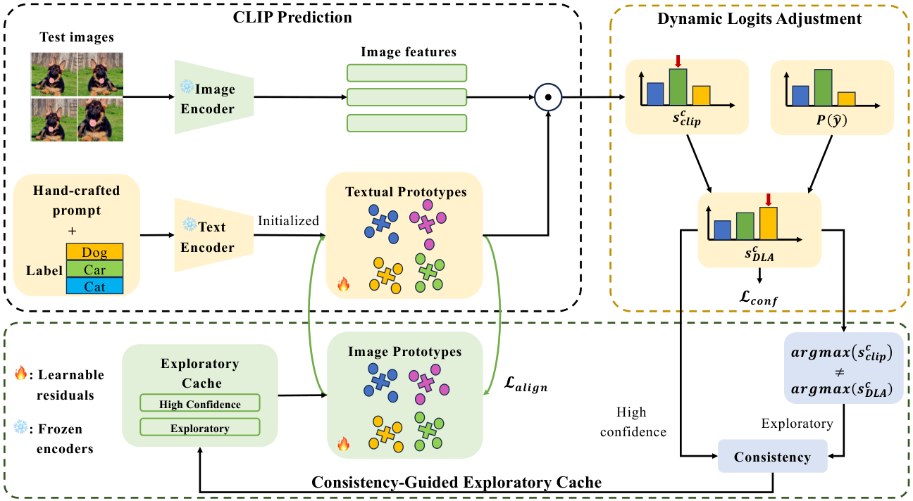

```

```

# [CVPR 2026] DLAE

[](https://zhangce01.github.io/DPE-CLIP/)
[](http://arxiv.org/abs/2410.12790)
[](https://neurips.cc/)
[](https://opensource.org/licenses/MIT)

## 👀Introduction

This repository contains the code for our CVPR 2026 paper `Dual Prototype Evolving for Test-Time Generalization of Vision-Language Models`. [[Paper](https://arxiv.org/abs/2410.12790)]



## ⏳Setup

#### 1. Environment

All experiments are conducted with **PyTorch 2.3.1 (cu121)** and **CUDA 12.1**. We use **torchvision 0.18.1 (cu121)**, **torchaudio 2.3.1 (cu121)**, and **Triton 3.1.0**. Key dependencies include **open-clip-torch 2.32.0** and **info-nce-pytorch 0.1.4** (installed following [https://github.com/RElbers/info-nce-pytorch](https://github.com/RElbers/info-nce-pytorch)).

#### 2. Dataset

To set up all required datasets, kindly refer to the guidance in [DATASETS.md](docs/DATASETS.md), which incorporates steps for installing two benchmarks.

## 📦Usage

To run the code, you can execute the following 4 bash scripts:

#### Robustness to Natural Distribution Shifts

* **ResNet50**: Run DPE on the OOD Benchmark using the ResNet-50 model:

```
bash ./scripts/run_ood_benchmark_rn50.sh 
```

* **ViT/B-16**: Run DPE on the OOD Benchmark using the ViT/B-16 model.

```
bash ./scripts/run_ood_benchmark_vit.sh 
```

#### Cross-Datasets Generalization

* **ResNet50**: Run DLAE on the Cross-Domain Benchmark using the ResNet-50 model:

```
bash ./scripts/run_cd_benchmark_rn50.sh 
```

* **ViT/B-16**: Run DLAE on the Cross-Domain Benchmark using the ViT/B-16 model.

```
bash ./scripts/run_cd_benchmark_vit.sh 
```

#### Arguments

In each bash script, you can modify the following arguments: (1) `--datasets` to specify the datasets, (2) `--backbone` to specify the backbone model (RN50 and ViT-B/16) .


## 🙏Acknowledgements

Our codebase is adapted from  [CLIP](https://github.com/openai/CLIP/tree/main/clip), [TDA](https://github.com/kdiAAA/TDA), [TPT](https://github.com/azshue/TPT),  [CuPL](https://github.com/sarahpratt/CuPL) and [zhangce01/DPE-CLIP: [NeurIPS 2024] Code for Dual Prototype Evolving for Test-Time Generalization of Vision-Language Models](https://github.com/zhangce01/DPE-CLIP) . We thank the authors for releasing their code!


## 📌 BibTeX & Citation

If you find this code useful, please consider citing our work:
