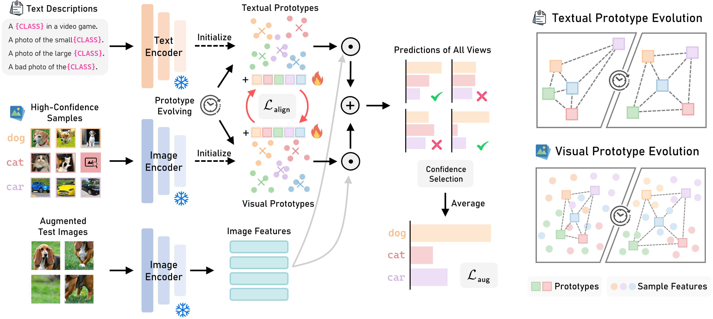

```

```

# [CVPR 2026] Dynamic Logits Adjustment and Exploration for Test-Time Adaptation in Vision Language Models

> [](https://github.com/whynotcooper/Dynamic-Logits-Adjustment-and-Exploration-for-Test-Time-Adaptation-in-Vision-Language-Models)
> [](https://cvpr.thecvf.com/)
> [](https://opensource.org/licenses/MIT)

## 👀Introduction

This repository contains the code for our CVPR 2026 paper .


|  | [Dynamic Logits Adjustment and Exploration for Test-Time Adaptation in Vision Language Models](https://openaccess.thecvf.com/content/CVPR2026/papers/Wu_Dynamic_Logits_Adjustment_and_Exploration_for_Test-Time_Adaptation_in_Vision_CVPR_2026_paper.pdf) |
| - | ------------------------------------------------------------------------------------------------------------------------------------------ |



## ⏳Setup

#### 1. Environment

All experiments are conducted with **PyTorch 2.3.1 (cu121)** and **CUDA 12.1**. We use **torchvision 0.18.1 (cu121)**, **torchaudio 2.3.1 (cu121)**, and **Triton 3.1.0**. Key dependencies include **open-clip-torch 2.32.0** and **info-nce-pytorch 0.1.4** (installed following [https://github.com/RElbers/info-nce-pytorch](https://github.com/RElbers/info-nce-pytorch)).

#### 2. Dataset

To set up all required datasets, kindly refer to the guidance in [DATASETS.md](docs/DATASETS.md), which incorporates steps for installing two benchmarks.

## 📦Usage

To run the code, you can execute the following 4 bash scripts:

#### Robustness to Natural Distribution Shifts

* **ResNet50**: Run DPE on the OOD Benchmark using the ResNet-50 model:

```
bash ./scripts/run_ood_benchmark_rn50.sh 
```

* **ViT/B-16**: Run DPE on the OOD Benchmark using the ViT/B-16 model.

```
bash ./scripts/run_ood_benchmark_vit.sh 
```

#### Cross-Datasets Generalization

* **ResNet50**: Run DPE on the Cross-Domain Benchmark using the ResNet-50 model:

```
bash ./scripts/run_cd_benchmark_rn50.sh 
```

* **ViT/B-16**: Run DPE on the Cross-Domain Benchmark using the ViT/B-16 model.

```
bash ./scripts/run_cd_benchmark_vit.sh 
```

#### Arguments

In each bash script, you can modify the following arguments: (1) `--datasets` to specify the datasets, and (2) `--backbone` to specify the backbone model (e.g., RN50 and ViT-B/16).

## 🙏 Acknowledgements

Our codebase is based on [CLIP](https://github.com/openai/CLIP/tree/main/clip), [TDA](https://github.com/kdiAAA/TDA), [TPT](https://github.com/azshue/TPT), [CuPL](https://github.com/sarahpratt/CuPL), and [DPE-CLIP](https://github.com/zhangce01/DPE-CLIP). We sincerely thank the authors for their open-source contributions.

## 📌 BibTeX & Citation

If you find this code or our paper helpful for your research, please consider citing:

```

@InProceedings{Wu_2026_CVPR,
  author = {Wu, Haoyan and Liu, Yahao and Lei, Yinjie and Duan, Lixin and Li, Wen},
  title = {Dynamic Logits Adjustment and Exploration for Test-Time Adaptation in Vision Language Models},
  booktitle = {Proceedings of the IEEE/CVF Conference on Computer Vision and Pattern Recognition (CVPR)},
  month = {June},
  year = {2026},
  pages = {3143-3153}
}


```
